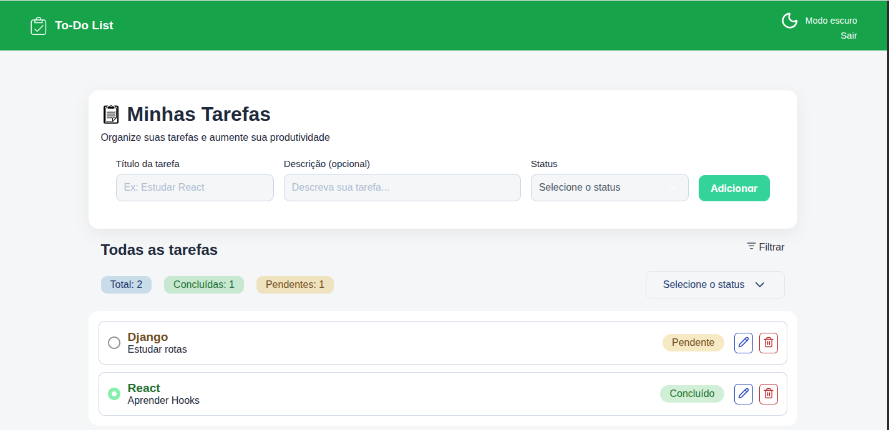

# 🗂️ TaskFlow

Um sistema de gerenciamento de tarefas (To-Do List) com autenticação JWT, desenvolvido com **React + Django REST Framework**.

---

## ✨ Demonstração

🔗 Frontend: https://taskflow-web-mauve.vercel.app  
🔗 Backend API: https://web-production-564941.up.railway.app  

---

## 📸 Preview

<p align="center">
  
</p>

---

## 🚀 Funcionalidades

- 🔐 Login com JWT (access + refresh token)
- 📋 Criar tarefas
- ✏️ Editar tarefas
- ❌ Excluir tarefas
- ✅ Marcar como concluída
- 🔎 Filtro de status (pendente / concluído)
- 🌐 API integrada com backend Django
- 📱 Layout responsivo

---

## 🛠️ Tecnologias
---
### Frontend
- React
- Vite
- PrimeReact
- Axios
- CSS puro (custom)

### Backend
- Django
- Django REST Framework
- SimpleJWT
- CORS Headers
- PostgreSQL (Railway)

---

## ⚙️ Instalação local
---
### 📦 Frontend

```bash
git clone https://github.com/seu-usuario/taskflow-frontend.git
cd taskflow-frontend
npm install
npm run dev
```
---

### 🔧 Variáveis de ambiente

Crie um arquivo .env:
```bash
VITE_API_URL=https://web-production-564941.up.railway.app
```

---

### 🖥️ Backend

```bash
git clone https://github.com/seu-usuario/taskflow-backend.git
cd taskflow-backend
pip install -r requirements.txt
python manage.py migrate
python manage.py runserver
```

---
### 🔐 Autenticação

O sistema usa JWT:

access token → autenticação das requisições
refresh token → renovação de sessão

Endpoint:
POST /api/token/


---

### 📡 Endpoints principais

```bash
| Método | Endpoint        | Descrição        |
| ------ | --------------- | ---------------- |
| POST   | /api/token/     | Login            |
| GET    | /api/tasks/     | Listar tarefas   |
| POST   | /api/tasks/     | Criar tarefa     |
| PATCH  | /api/tasks/:id/ | Atualizar tarefa |
| DELETE | /api/tasks/:id/ | Remover tarefa   |
```


---
### 🧠 Aprendizados

Este projeto me ajudou a entender:

Autenticação JWT
Consumo de API REST
Deploy com Vercel e Railway
Integração frontend + backend
Controle de estado no React

---

### 🚀 Deploy
Frontend: Vercel
Backend: Railway

---

### 📌 Melhorias futuras
 Dark mode toggle

 Drag and drop de tarefas

 Perfis de usuário

 Reset de senha

 Notificações

 ---
 
 ### 👨‍💻 Autor
 Feito por Monaliza Vasconcelos

